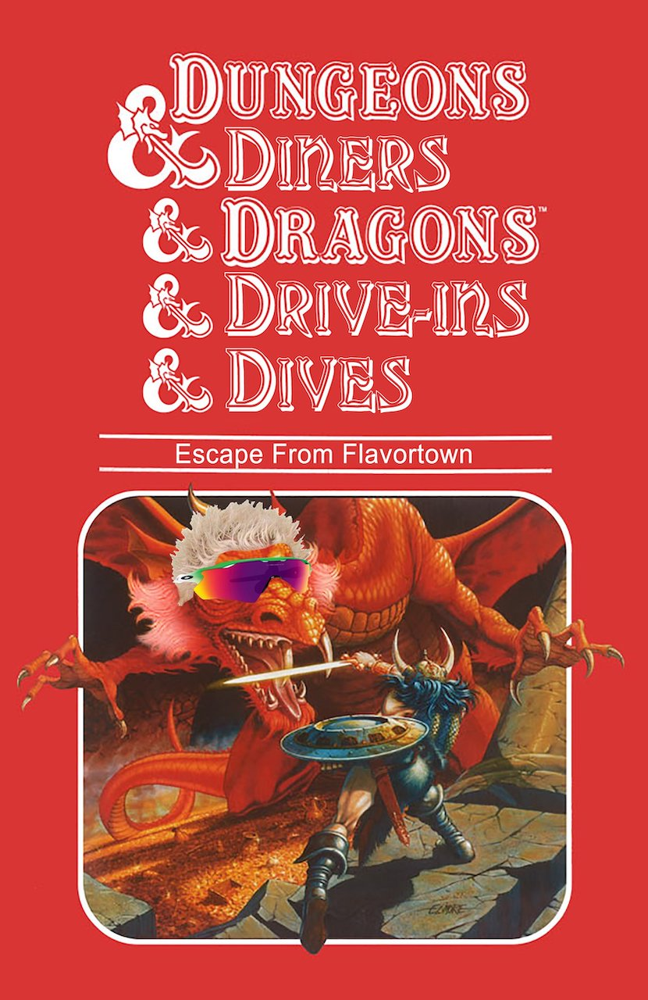

# Diners & Dungeons & Drive-ins & Dragons & Dives

Some time ago I saw this picture online. It was a parody of the old D&D modules combing D&D with the Food Network show. I thought it'd be funnier of the two titles were more thoroughly interwoven, so when I was experimenting with [Cortex Prime](https://cortexrpg.com) I made this for my kids at camp.

Two summers ago (2024) I ran this three times. The first was a beta test with my gamer friends. Then at [Summer Camp](https://camponestep.org/summer-camp/#summer-camp) I ran it twice with my kids.
